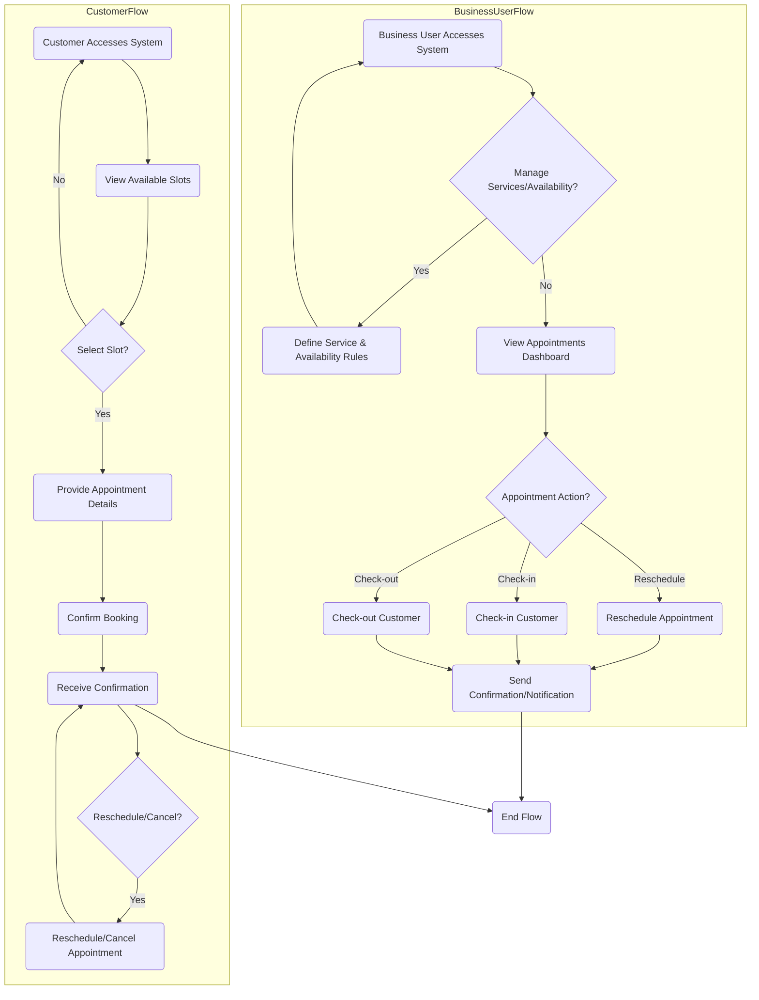

# Overview

This document outlines the product requirements for a generic Appointment Scheduling application designed for small businesses across various industries. The primary goal is to provide a flexible and intuitive platform that enables efficient management of appointments, catering to the distinct needs of both business users and their customers.

The application will empower **Business Users** to define appointment rules, review and manage schedules, reschedule appointments, handle check-ins and check-outs, and access basic analytics for operational insights. Concurrently, **Customers** will have the convenience of independently scheduling and rescheduling their appointments, with visibility into available time slots while maintaining privacy regarding other customers' information.

## Goals

*   **Flexibility:** Provide a highly configurable system adaptable to various small business types.
*   **Efficiency:** Streamline appointment management processes for business users.
*   **Customer Autonomy:** Empower customers with self-service scheduling capabilities.
*   **Clarity:** Ensure clear visibility of schedules and availability without compromising privacy.
*   **Maintainability:** Emphasize clean code and modular design for future enhancements.

# Process Flow


# Requirements

| Requirement # | Requirement | Acceptance Criteria |
| ---- | ---- | ---- |
| **Business User Requirements** | | |
| 001 | Business users must be able to define services offered and their corresponding availability rules (e.g., operating hours, duration per service, buffer times). | <ul><li>The system provides an interface for business users to create, edit, and delete services.</li><li>Business users can set specific working hours for each day of the week.</li><li>Business users can define the default duration for each service.</li><li>Business users can define buffer times between appointments.</li></ul> |
| 002 | Business users must be able to view all scheduled appointments in a clear and organized manner (e.g., daily, weekly, monthly calendar views). | <ul><li>The system displays appointments in daily, weekly, and monthly calendar views.</li><li>Each appointment clearly shows customer name, service, date, and time.</li><li>Business users can easily navigate between different dates and views.</li></ul> |
| 003 | Business users must be able to reschedule existing appointments. | <ul><li>Business users can select an existing appointment and choose a new date/time.</li><li>The system validates the new time slot against availability rules.</li><li>Upon successful rescheduling, both the business user and customer receive notifications.</li></ul> |
| 004 | Business users must be able to check customers in and out of appointments. | <ul><li>The system provides a clear mechanism to mark an appointment as 'checked-in'.</li><li>The system provides a clear mechanism to mark an appointment as 'checked-out' or 'completed'.</li><li>The status of appointments is updated in real-time on the dashboard.</li></ul> |
| 005 | Business users must have access to simple analytics and dashboards related to appointments (e.g., number of appointments per day/week, popular services). | <ul><li>The system displays a dashboard with key metrics (e.g., total appointments, revenue if applicable, service popularity).</li><li>Analytics can be filtered by date range or service type.</li><li>Data is presented in an easily digestible format (e.g., charts, summary numbers).</li></ul> |
| **Customer Requirements** | | |
| 006 | Customers must be able to schedule new appointments online. | <ul><li>Customers can browse available services.</li><li>Customers can select a desired service and view available time slots.</li><li>Customers can provide necessary contact information and appointment details.</li><li>Upon successful booking, customers receive an instant confirmation.</li></ul> |
| 007 | Customers must be able to reschedule their own appointments online. | <ul><li>Customers can view their upcoming appointments.</li><li>Customers can select an appointment to reschedule and choose a new available time slot.</li><li>The system sends confirmation of the rescheduled appointment.</li><li>The system prevents customers from rescheduling appointments outside of predefined rules (e.g., too close to the appointment time).</li></ul> |
| 008 | Customers must be able to view available time slots for appointments without seeing other customer information. | <ul><li>The system clearly displays available time slots for a chosen service.</li><li>No personally identifiable information of other customers is visible.</li><li>The availability display is real-time and accurate.</li></ul> |

# Error Handling

| Error Scenario | Expected Result |
| ---- | ---- |
| Customer attempts to schedule an appointment in an already booked slot. | <ul><li>The system prevents the booking and displays a clear message indicating the slot is unavailable.</li><li>The customer is prompted to select an alternative time.</li></ul> |
| Customer attempts to reschedule an appointment outside of allowed timeframes (e.g., within 24 hours of appointment). | <ul><li>The system prevents the reschedule and displays a message explaining the restriction.</li><li>The customer is informed of the earliest possible time to reschedule.</li></ul> |
| Business user attempts to define conflicting availability rules. | <ul><li>The system alerts the business user to the conflict.</li><li>The system suggests adjustments or prevents saving the conflicting rule until resolved.</li></ul> |
| Invalid input for date, time, or other appointment details. | <ul><li>The system highlights the invalid input field.</li><li>A clear error message is displayed next to the field, guiding the user on correct input format.</li></ul> |

# User Interface (UI) and User Experience (UX) Requirements

| Requirement # | Requirement | Acceptance Criteria |
| ---- | ---- | ---- |
| 009 | The application must provide a clear and intuitive dashboard for business users to manage appointments and view analytics. | <ul><li>The dashboard displays a summary of upcoming appointments, key metrics, and quick access to common actions.</li><li>Navigation to different sections (e.g., calendar, services, reports) is clearly signposted.</li><li>The layout is clean, uncluttered, and responsive to different screen sizes.</li></ul> |
| 010 | The customer interface for scheduling appointments must be simple, guided, and mobile-friendly. | <ul><li>The booking process is a step-by-step flow, guiding the customer through service selection, time slot choice, and detail submission.</li><li>The interface is optimized for use on various devices, including smartphones and tablets.</li><li>Clear prompts and visual cues assist the customer at each step.</li></ul> |
| 011 | Available time slots must be clearly distinguishable from booked or unavailable slots for customers, without revealing other customer details. | <ul><li>Available time slots are prominently displayed (e.g., in green) while unavailable slots are clearly marked (e.g., in grey).</li><li>No customer names or private information are shown alongside available or booked slots.</li><li>A calendar view allows customers to easily navigate dates to find available times.</li></ul> |
| 012 | Notifications and confirmations (for both business users and customers) must be clear, timely, and contain all necessary information. | <ul><li>Email and/or in-app notifications are sent for new bookings, reschedules, cancellations, and check-in/out.</li><li>Notifications include all relevant details: date, time, service, customer/business name, and any instructions.</li><li>Confirmation messages are displayed immediately after successful actions.</li></ul> |
| 013 | The application should provide consistent branding and a professional aesthetic suitable for a business tool. | <ul><li>A consistent color scheme, typography, and iconography are applied throughout the application.</li><li>The overall visual design is clean, modern, and professional.</li><li>The application adapts to basic branding customization (e.g., business logo upload).</li></ul> |

# Non-Functional Requirements

| Requirement # | Requirement | Acceptance Criteria |
| ---- | ---- | ---- |
| 014 | The application must exhibit high performance for both business users and customers, with quick loading times and responsive interactions. | <ul><li>Appointment scheduling and viewing operations complete within 2 seconds under normal load.</li><li>Dashboard analytics load within 5 seconds.</li><li>The application remains responsive with up to 100 concurrent users.</li></ul> |
| 015 | The application must ensure data security and privacy for all user information, especially customer details and appointment data. | <ul><li>All data in transit and at rest is encrypted.</li><li>Access to sensitive customer information is restricted to authorized business users.</li><li>The application adheres to relevant data protection regulations (e.g., GDPR, CCPA).</li><li>Regular security audits and vulnerability assessments are conducted.</li></ul> |
| 016 | The application should be scalable to accommodate a growing number of businesses, services, and appointments without significant degradation in performance. | <ul><li>The architecture supports horizontal scaling of application and database servers.</li><li>The system can handle a 10x increase in appointment volume and user count without major architectural changes.</li><li>Load balancing and auto-scaling mechanisms are in place.</li></ul> |
| 017 | The codebase must be well-structured, modular, and adhere to established coding standards to facilitate maintainability and future enhancements. | <ul><li>The project is organized into logical modules (e.g., frontend, backend, database).</li><li>Code is consistently formatted and follows a recognized style guide.</li><li>Comprehensive documentation and inline comments are provided for complex logic.</li><li>Unit and integration tests cover critical functionalities.</li></ul> |
| 018 | The application must ensure high availability, minimizing downtime for scheduled maintenance or unexpected outages. | <ul><li>The system targets 99.9% uptime.</li><li>Backup and disaster recovery procedures are in place and regularly tested.</li><li>Redundant infrastructure components are utilized where appropriate.</li></ul> |
| 019 | The application should be compatible with modern web browsers and common operating systems for desktop and mobile devices. | <ul><li>The web application renders correctly and functions across Chrome, Firefox, Safari, and Edge (latest two versions).</li><li>The mobile interface is fully functional on iOS and Android devices.</li></ul> |

# Out of Scope

| Item | Reason for exclusion |
| ---- | ---- |
| **Payment Gateway Integration** | Integrating with payment systems adds significant complexity and security considerations beyond the core appointment management functionality. |
| **Advanced Reporting & Business Intelligence** | While basic analytics are included, complex reporting tools, custom report generation, and predictive analytics are out of scope for the initial version. |
| **Staff Management & Role-Based Access Control** | Full-fledged staff management (e.g., individual staff schedules, role-based permissions) is deferred to a later phase to simplify the initial scope. |
| **Customer Accounts & Profiles** | Detailed customer accounts with history, preferences, and loyalty programs are out of scope. Initial focus is on single-appointment scheduling. |
| **SMS Reminders & Marketing Automation** | Advanced communication features like automated SMS reminders or marketing campaign integration are beyond the initial MVP. Email notifications will suffice. |
| **Multi-location Support** | The initial application will focus on managing appointments for a single business location. Multi-location support adds significant architectural complexity. |

# Q&A

| Question | Answer |
| ---- | ---- |
| **What is the primary target audience for this application?** | Small businesses across various industries that require a generic appointment management solution, and their customers. |
| **How will business users define their services and availability?** | Through a dedicated administration interface where they can set service types, durations, working hours, and blackout periods. |
| **How will customers schedule appointments without seeing other customer information?** | The customer-facing interface will only display available time slots based on the business's defined rules, without any details about other bookings. |
| **What level of customization is available for businesses?** | Initial customization will include defining services, availability, and basic branding (e.g., logo upload). More advanced customization is out of scope for the first version. |
| **Will the application support recurring appointments?** | Yes, business users will be able to define recurring availability rules, and customers can book recurring slots if available. |
| **What is the deployment model for the application?** | The application is envisioned as a web-based service, accessible via a browser. Specific deployment details (e.g., cloud provider, self-hosted) will be determined during the technical design phase. |

# Mockups (Text-based Example)

```text
----------------------------------------------------
BUSINESS USER DASHBOARD
----------------------------------------------------
Welcome, [Business Name]!

Today's Appointments: 5 (2 Check-ins, 3 Scheduled)
Upcoming Week: 25 Appointments

--- Quick Actions ---
1. View Calendar
2. Manage Services
3. View Analytics

--- Upcoming Appointments ---
[Date]: 2025-12-25
Service: Haircut | Time: 10:00 AM | Customer: Alice Smith | Status: Scheduled
Service: Massage   | Time: 11:30 AM | Customer: Bob Johnson | Status: Checked-in

----------------------------------------------------

----------------------------------------------------
CUSTOMER SCHEDULING INTERFACE
----------------------------------------------------
Schedule Your Appointment with [Business Name]

1. Select Service:
   - Haircut (30 min)
   - Massage (60 min)
   - Nail Art (45 min)

2. Select Date: (Showing availability for selected service)
   [  <  Dec 2025  >  ]
   Mo Tu We Th Fr Sa Su
         24 25 26 27 28 29
   30 31

3. Available Time Slots for [Selected Service] on [Selected Date]:
   - 09:00 AM - 09:30 AM (Available)
   - 09:30 AM - 10:00 AM (Booked)
   - 10:00 AM - 10:30 AM (Available)

--- Your Details ---
Name: [Enter Name]
Email: [Enter Email]
Phone: [Enter Phone]

[BOOK APPOINTMENT] [RESCHEDULE EXISTING]
