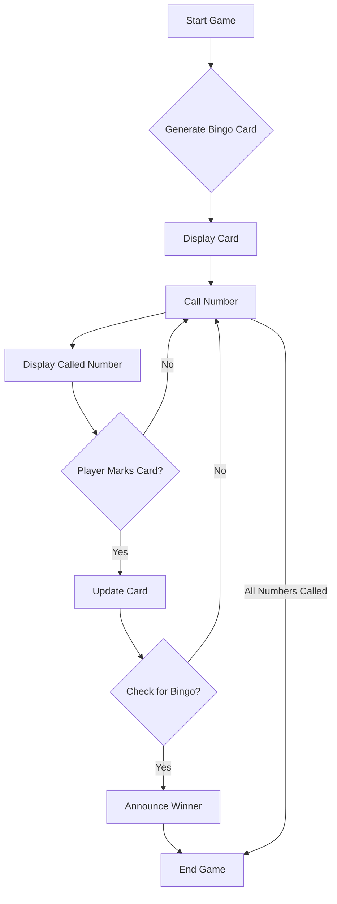

# Overview

This document outlines the requirements for a simple Bingo game, intended for a junior developer to build as part of their portfolio. The game will focus on core mechanics, a basic user interface, and clear, maintainable code.

*   **Educational Value:** Provide a clear and manageable project for a junior developer to showcase fundamental programming skills.
*   **Core Gameplay:** Implement the basic rules of Bingo (card generation, number calling, win condition checking).
*   **User Interface:** Offer a simple, text-based or basic graphical interface for user interaction.
*   **Modularity:** Encourage good software design practices through modular components.

# Process Flow



# Requirements

| Requirement # | Requirement | Acceptance Criteria |
| ---- | ---- | ---- |
| 001 | As a player, I want to start a new game of Bingo so that I can play. | <ul><li>The game presents an option to start a new game.</li><li>Selecting the option initiates a new game session.</li><li>The Bingo card is reset and new numbers are generated.</li></ul> |
| 002 | As a player, I want to have a unique Bingo card so that each game is different. | <ul><li>A new, randomly generated 5x5 Bingo card is presented at the start of each game.</li><li>The numbers on the card are unique within their respective columns and differ from previous games.</li></ul> |
| 003 | As a player, I want to see numbers called one by one so that I can mark my card. | <ul><li>Called numbers are displayed individually to the player.</li><li>The player can input a number to mark on their card.</li><li>The UI updates to show the marked number.</li></ul> |
| 004 | As a player, I want to be notified when I have a Bingo (a winning line) so that I know I have won. | <ul><li>Upon achieving a Bingo, a clear notification is displayed to the player.</li><li>The winning line on the Bingo card is visually highlighted.</li></ul> |
| 005 | As a player, I want to be able to quit the game at any time. | <ul><li>An option to quit the game is available during gameplay.</li><li>Selecting the quit option ends the current game session.</li></ul> |
| 006 | As a game administrator, I want to start calling numbers automatically or manually so that the game progresses. | <ul><li>The game provides an option to toggle between automatic and manual number calling.</li><li>In automatic mode, numbers are called at a predefined interval.</li><li>In manual mode, numbers are called upon explicit administrator action.</li></ul> |
| 007 | As a game administrator, I want to know when a player has achieved Bingo. | <ul><li>A clear notification is displayed to the administrator when a player achieves Bingo.</li><li>The winning player and their Bingo card are clearly identified.</li></ul> |
| 008 | Option to start a new game. | <ul><li>A "Start New Game" option is available from the main menu or upon game completion.</li><li>Selecting this option resets the game state and generates a new Bingo card.</li></ul> |
| 009 | Generate a standard 5x5 Bingo card with specific number ranges for each column (B: 1-15, I: 16-30, N: 31-45, G: 46-60, O: 61-75), unique numbers within each column, and a free space in the center of the 'N' column. | <ul><li>The generated Bingo card is a 5x5 grid.</li><li>Column 'B' contains 5 unique numbers from 1-15.</li><li>Column 'I' contains 5 unique numbers from 16-30.</li><li>Column 'N' contains 4 unique numbers from 31-45, with the center cell marked as "FREE".</li><li>Column 'G' contains 5 unique numbers from 46-60.</li><li>Column 'O' contains 5 unique numbers from 61-75.</li></ul> |
| 010 | Randomly select numbers from 1-75 without replacement and display the called number to the player, keeping track of already called numbers. | <ul><li>Numbers are randomly selected from 1-75.</li><li>Each number is called only once per game.</li><li>The currently called number is clearly displayed to the player.</li><li>A list of previously called numbers is maintained and visible.</li></ul> |
| 011 | Allow the player to mark numbers on their card that match the called number and provide feedback if a player tries to mark a number that hasn't been called or is already marked. | <ul><li>The player can input a valid cell (e.g., B7) to mark.</li><li>If the input number matches a called number and is on the player's card, the cell is marked.</li><li>If the player attempts to mark an uncalled number, an already marked number, or an invalid cell, appropriate feedback is displayed.</li></ul> |
| 012 | Automatically detect when a player achieves a Bingo (5 marked squares in a row, column, or diagonal, including the free space), support multiple Bingo patterns, and announce the winner. | <ul><li>After each mark, the game checks for a winning pattern (horizontal, vertical, or diagonal).</li><li>The winning player is announced clearly.</li><li>The game highlights the winning line(s).</li></ul> |
| 013 | Graceful handling of invalid user inputs. | <ul><li>Invalid inputs (e.g., non-existent numbers, wrong format) do not crash the game.</li><li>Clear, user-friendly error messages are displayed for invalid inputs.</li><li>The game state remains stable after invalid inputs.</li></ul> |
| 014 | Display the player's 5x5 Bingo card, clearly indicating marked and unmarked numbers, and the free space. | <ul><li>The 5x5 Bingo card is visible on the screen.</li><li>Marked numbers are clearly distinguishable (e.g., different color, strike-through).</li><li>The "FREE" space is prominently displayed and automatically marked.</li></ul> |
| 015 | Display the currently called number and a list of previously called numbers. | <ul><li>The most recently called number is prominently displayed.</li><li>A historical list of all called numbers is accessible to the player.</li></ul> |
| 016 | Allow player to input which number on their card to mark (e.g., "mark B5"). | <ul><li>A clear input prompt guides the player to enter their move.</li><li>The input mechanism is responsive and user-friendly.</li></ul> |
| 017 | Display messages for game start, numbers called, Bingo, errors, etc. | <ul><li>Informative messages are displayed for key game events (e.g., "Game Started!", "B7 called!").</li><li>Messages are clear, concise, and do not obstruct gameplay.</li></ul> |
# Non-Functional Requirements

| Requirement # | Requirement | Acceptance Criteria |
| ---- | ---- | ---- |
| 018 | **Project Structure:** Clear separation of concerns (e.g., `Game` class, `Player` class, `BingoCard` class, `NumberCaller` class). | <ul><li>The project is organized into logical, distinct classes (e.g., `BingoCard`, `NumberCaller`, `GameLogic`).</li><li>Each class has a clear, single responsibility.</li></ul> |
| 019 | **Data Structures:** Utilize appropriate data structures for cards, called numbers, etc. | <ul><li>Efficient data structures are used for storing Bingo card numbers and tracking called numbers (e.g., `Set` for called numbers).</li><li>Data structures chosen optimize for performance and memory usage.</li></ul> |
| 020 | **Unit Tests (Recommended):** Basic unit tests for core functionalities (e.g., card generation, win checking). | <ul><li>Unit tests are provided for key game logic components (e.g., `BingoCard` generation, win condition checks).</li><li>Tests cover common scenarios and edge cases.</li><li>Tests can be run independently and pass consistently.</li></ul> |

# Out of Scope

| Item | Reason for exclusion |
| ---- | ---- |
| Multiple players. | This initial scope focuses on single-player core gameplay mechanics. |
| Different Bingo patterns (e.g., "Blackout", "Letter X"). | To keep the initial scope manageable, only straight line Bingos will be implemented. |
| Graphical User Interface (GUI). | The initial implementation will be text-based for simplicity. |
| Sound effects. | Sound effects are a non-essential feature for the core game. |
| Persistence of game state. | Storing game state would add complexity with file I/O or database integration. |
| Difficulty levels (e.g., faster number calling). | To keep the initial scope manageable, a single calling speed will be implemented. |

| Question | Answer |
| ---- | ---- |
| **What is the primary target audience for this game?** | Casual players seeking a simple Bingo experience. |
| **How should game configuration (card generation, number calling speed) be managed?** | Initially, through in-game prompts or a simple configuration menu at the start of a new game. |
| **Is there a preference for a specific type of user input (e.g., console vs. graphical)?** | The initial implementation can be console-based for simplicity. A graphical interface is a planned future enhancement. |

# Mockups (Text-based Example)

```text
---------------------------------
| B  | I  | N  | G  | O  |
---------------------------------
| 1  | 16 | 31 | 46 | 61 |
| 2  | 17 | 32 | 47 | 62 |
| 3  | 18 | FREE | 48 | 63 |
| 4  | 19 | 33 | 49 | 64 |
| 5  | 20 | 34 | 50 | 65 |
---------------------------------

Last Called: N38
Called Numbers: B7, I22, N38, G55, O71

Enter number to mark (e.g., B7): 
```
