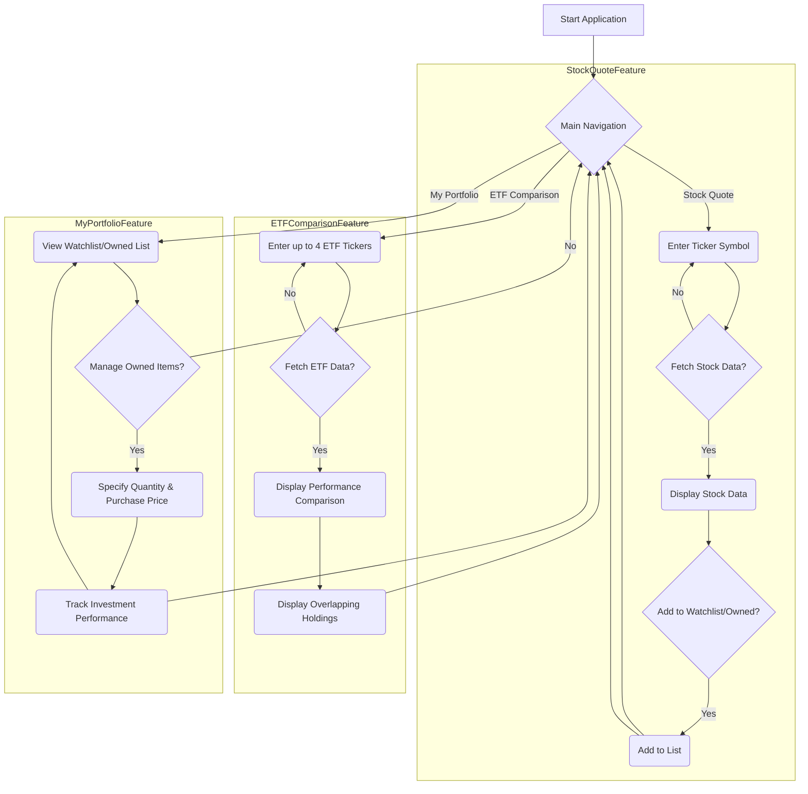

# Overview

This document outlines the product requirements for a Stock Quote Tool web application. The primary goal of this application is to provide users with real-time and historical stock data, enable comparative analysis of Exchange Traded Funds (ETFs), and offer personal portfolio tracking functionalities.

The tool will leverage a public API to fetch up-to-date stock and ETF information. Key features include the ability for users to search for individual stock ticker symbols to view relevant data, a dedicated page for comparing up to four ETFs and identifying overlapping holdings, and a comprehensive portfolio management section where users can track owned stocks/ETFs, specify quantities and average purchase prices, and automatically monitor investment performance.

## Goals

*   **Real-time Data Access:** Provide users with up-to-date stock and ETF information.
*   **ETF Comparison:** Enable users to compare multiple ETFs and understand their underlying holdings.
*   **Personalized Portfolio Tracking:** Allow users to track their investments and monitor performance.
*   **User-Friendly Interface:** Offer an intuitive and easy-to-navigate web application.
*   **API Utilization:** Efficiently integrate with a public stock market API for data retrieval.

# Process Flow


# Requirements

| Requirement # | Requirement | Acceptance Criteria |
| ---- | ---- | ---- |
| **Stock Quote & Data** | | |
| 001 | Users must be able to enter a ticker symbol to view relevant stock data. | <ul><li>A dedicated input field accepts ticker symbols.</li><li>Upon submission, the system displays the latest price, daily change, volume, market cap, and other key metrics for the entered ticker.</li><li>The data is fetched from a public stock API.</li></ul> |
| 002 | The stock data displayed should be up-to-date. | <ul><li>Stock prices and other dynamic data points are updated regularly (e.g., every 5-10 seconds for real-time data, or on page refresh for delayed data based on API capabilities).</li><li>A timestamp indicates when the data was last updated.</li></ul> |
| **ETF Comparison** | | |
| 003 | Users must be able to enter up to four ETF ticker symbols for comparison. | <ul><li>A dedicated input interface allows users to add 1-4 ETF ticker symbols.</li><li>The system validates that the entered symbols are indeed ETFs.</li></ul> |
| 004 | The system must display a performance comparison of the selected ETFs. | <ul><li>A comparative chart or table shows the historical performance of the selected ETFs over various periods (e.g., 1-month, 3-month, 1-year, 5-year).</li><li>Key metrics such as expense ratio, dividend yield, and AUM are displayed for each ETF.</li></ul> |
| 005 | The system must show where the selected ETFs overlap with each other in terms of holdings. | <ul><li>A clear visualization or list identifies common underlying stocks held by the selected ETFs.</li><li>The percentage of overlap or the value of overlapping holdings is displayed.</li></ul> |
| **Watchlist & Owned List** | | |
| 006 | Users must be able to add stocks and ETFs to a "Watchlist". | <ul><li>A button or option is available on the stock/ETF detail pages to add an item to the watchlist.</li><li>Items added to the watchlist appear on a dedicated "Watchlist" page.</li><li>The watchlist displays the current price and daily performance of each item.</li></ul> |
| 007 | Users must be able to add stocks and ETFs to an "Owned List". | <ul><li>A button or option is available on the stock/ETF detail pages to add an item to the owned list.</li><li>Items added to the owned list appear on a dedicated "Owned" page.</li></ul> |
| 008 | On the "Owned List" page, users must be able to specify their owned quantity and average purchase price for each item. | <ul><li>Editable input fields are provided for quantity and average purchase price for each owned stock/ETF.</li><li>The system stores and retrieves this information persistently.</li></ul> |
| 009 | The "Owned List" page must automatically track the user's investment performance. | <ul><li>For each owned item, the system calculates and displays the current market value, total gain/loss (in dollars and percentage), and daily gain/loss.</li><li>The overall portfolio performance (total gain/loss across all owned items) is displayed.</li><li>Performance metrics are updated based on current stock/ETF prices.</li></ul> |
| **General** | | |
| 010 | The application should utilize a public API for fetching stock and ETF data. | <ul><li>The application successfully connects to and retrieves data from a chosen public stock API.</li><li>API rate limits are handled gracefully to ensure continuous data flow.</li><li>Error handling for API failures is implemented.</li></ul> |

# Error Handling

| Error Scenario | Expected Result |
| ---- | ---- |
| User enters an invalid or non-existent ticker symbol. | <ul><li>The system displays a clear error message (e.g., "Invalid ticker symbol. Please try again.").</li><li>No data is displayed, or previous data remains visible.</li><li>The application remains responsive.</li></ul> |
| Public API is unavailable or returns an error. | <ul><li>The system displays a message indicating that data cannot be retrieved (e.g., "Unable to fetch data. Please try again later.").</li><li>The application gracefully handles the error without crashing.</li><li>Previously loaded data (if any) remains visible where possible.</li></ul> |
| User attempts to add a non-stock/ETF ticker to Watchlist/Owned List. | <ul><li>The system prevents the addition and displays an error message (e.g., "Only stocks and ETFs can be added to this list.").</li><li>The list remains unchanged.</li></ul> |
| Invalid input for quantity or purchase price on the Owned List. | <ul><li>The system highlights the invalid input field.</li><li>A clear error message is displayed next to the field, guiding the user on correct input format (e.g., "Please enter a valid number.").</li></ul> |

# User Interface (UI) and User Experience (UX) Requirements

| Requirement # | Requirement | Acceptance Criteria |
| ---- | ---- | ---- |
| 011 | The application must feature intuitive navigation between different sections (Stock Quote, ETF Comparison, My Portfolio). | <ul><li>A clear navigation bar or menu allows users to easily switch between pages.</li><li>The current active page is visually highlighted.</li><li>Navigation is consistent across the application.</li></ul> |
| 012 | Stock and ETF data must be presented clearly and legibly. | <ul><li>Key data points (e.g., price, change, volume) are prominently displayed and easy to read.</li><li>Charts and tables used for comparison or performance tracking are well-labeled and understandable.</li><li>Color-coding is used effectively to indicate positive/negative changes.</li></ul> |
| 013 | The ETF comparison page must clearly visualize performance differences and overlapping holdings. | <ul><li>Performance charts allow for easy visual comparison of multiple ETFs.</li><li>Overlapping holdings are presented in a clear, sortable, and filterable manner.</li><li>The user can easily understand the similarities and differences between selected ETFs.</li></ul> |
| 014 | The "My Portfolio" page must provide a comprehensive yet understandable overview of investment performance. | <ul><li>The page clearly displays individual stock/ETF performance, total portfolio value, and overall gain/loss.</li><li>Data updates automatically as market prices change.</li><li>Input fields for quantity and purchase price are clearly labeled and easy to use.</li></ul> |
| 015 | The application should be responsive and function well across various devices and screen sizes. | <ul><li>The layout adjusts gracefully to different screen resolutions (desktop, tablet, mobile).</li><li>All functionalities are accessible and usable on mobile devices.</li><li>Touch interactions are smooth and intuitive.</li></ul> |
| 016 | A consistent and professional visual design should be maintained throughout the application. | <ul><li>A cohesive color scheme, typography, and iconography are used.</li><li>The overall aesthetic is clean, modern, and trustworthy for financial data.</li><li>User feedback (e.g., loading indicators, success messages) is clear and consistent.</li></ul> |

# Non-Functional Requirements

| Requirement # | Requirement | Acceptance Criteria |
| ---- | ---- | ---- |
| 017 | The application must fetch and display stock/ETF data with minimal latency. | <ul><li>Stock and ETF data loads within 2-3 seconds for individual ticker searches.</li><li>ETF comparison data, including performance charts and overlaps, loads within 5 seconds.</li><li>The application remains responsive during data fetching operations.</li></ul> |
| 018 | The application must ensure the security of API keys and any user-specific data (watchlist, owned list). | <ul><li>API keys are stored securely and not exposed on the client-side.</li><li>User-specific data (owned quantity, purchase price) is stored securely and associated with a user session.</li><li>All communication with the backend (if user data is stored) is encrypted (HTTPS).</li></ul> |
| 019 | The stock and ETF data displayed must be accurate and reliable. | <ul><li>Data retrieved from the public API accurately reflects market conditions.</li><li>Discrepancies in data are minimal and addressed promptly.</li><li>A disclaimer about data sources and potential delays is visible.</li></ul> |
| 020 | The application should be scalable to handle an increasing number of users and API requests. | <ul><li>The backend infrastructure (if applicable for user data) supports horizontal scaling.</li><li>API rate limits are managed efficiently to prevent service interruptions.</li><li>The database (if applicable) can handle growth in user portfolios.</li></ul> |
| 021 | The application must demonstrate robust integration with the chosen public stock API. | <ul><li>API calls are structured and handled efficiently.</li><li>Error responses from the API are gracefully managed and communicated to the user.</li><li>The application can switch to a fallback data source or display cached data in case of primary API failure (if feasible).</li></ul> |
| 022 | The codebase must be well-structured, modular, and adhere to established coding standards to facilitate maintainability and future enhancements. | <ul><li>The project is organized into logical modules (e.g., UI components, data services, API integration).</li><li>Code is consistently formatted and follows a recognized style guide.</li><li>Comprehensive documentation and inline comments are provided for complex logic.</li><li>Unit and integration tests cover critical functionalities.</li></ul> |

# Out of Scope

| Item | Reason for exclusion |
| ---- | ---- |
| **Advanced Charting Features** | While basic performance charts are included, advanced charting tools (e.g., technical indicators, custom overlays) are beyond the initial scope. |
| **Trading Functionalities** | The tool is purely for informational and tracking purposes; direct buying or selling of stocks/ETFs is not supported. |
| **News Feeds & Sentiment Analysis** | Integrating real-time news feeds or performing sentiment analysis on market data is outside the core functionality for this version. |
| **User Authentication & Profiles** | User accounts for saving watchlists and owned lists are planned, but advanced user profiles with personalized recommendations or social features are out of scope. |
| **Historical Data Download** | Users will be able to view historical data within the application, but direct download functionality for large datasets is not included. |
| **Alerts & Notifications** | Real-time price alerts or news notifications are not part of the initial release. |

# Q&A

| Question | Answer |
| ---- | ---- |
| **What public API will be used for stock data?** | The specific public API will be selected during the technical design phase, prioritizing reliability, comprehensive data, and reasonable rate limits (e.g., Alpha Vantage, IEX Cloud, Finnhub). |
| **How will user-specific data (watchlist, owned list) be stored?** | User data will be stored persistently on a backend server, associated with a user account. Initial implementation might use local storage for demonstration purposes, but a database will be used for a production-ready version. |
| **Will the application support real-time streaming of stock quotes?** | While the goal is to provide up-to-date data, true real-time streaming (millisecond updates) will depend on the capabilities and cost of the chosen public API. The MVP will aim for frequent updates (e.g., every 5-10 seconds). |
| **What kind of data will be available for ETF overlaps?** | The ETF overlap feature will primarily focus on identifying common equity holdings and their respective weights or values within the ETFs. |
| **Is there a limit to the number of stocks/ETFs a user can add to their lists?** | For the initial version, there will be a reasonable soft limit (e.g., 50 items per list) to ensure performance. This can be adjusted in future iterations. |
| **How will historical performance be calculated for owned items?** | Historical performance will be calculated based on the specified average purchase price, current market price, and owned quantity, showing total and daily gain/loss. |

# Mockups (Text-based Example)

```text
----------------------------------------------------
STOCK QUOTE PAGE
----------------------------------------------------

Search Ticker: [AAPL    ] [Search]

--- Apple Inc. (AAPL) ---
Last Price: $175.25
Change Today: +$3.50 (+2.04%)
Volume: 75.2M
Market Cap: $2.75T

[Add to Watchlist] [Add to Owned List]

----------------------------------------------------

----------------------------------------------------
ETF COMPARISON PAGE
----------------------------------------------------

Compare ETFs: 
ETF 1: [SPY     ] 
ETF 2: [QQQ     ] 
ETF 3: [DIA     ] 
ETF 4: [IWM     ] 
[Compare]

--- Performance Comparison (Last 1 Year) ---
SPY: +25.1%
QQQ: +38.7%
DIA: +18.5%
IWM: +12.3%

--- Overlapping Holdings ---
Common Stock | SPY % | QQQ % | DIA % | IWM %
--------------------------------------------------
Microsoft    | 5.2%  | 8.1%  | 4.5%  | 0.0%
Apple        | 4.8%  | 7.9%  | 0.0%  | 0.0%
Amazon       | 3.1%  | 6.5%  | 0.0%  | 0.0%

----------------------------------------------------

----------------------------------------------------
MY PORTFOLIO (OWNED ITEMS) PAGE
----------------------------------------------------

--- My Owned Investments ---

Ticker | Quantity | Avg. Purchase Price | Current Price | Market Value | Total Gain/Loss | Daily Gain/Loss
----------------------------------------------------------------------------------------------------------------
AAPL   | 10       | $150.00             | $175.25       | $1752.50     | +$252.50 (+16.83%) | +$35.00 (+2.04%)
MSFT   | 5        | $200.00             | $210.50       | $1052.50     | +$52.50 (+5.25%)  | +$10.00 (+0.96%)

--- Portfolio Summary ---
Total Market Value: $2805.00
Total Portfolio Gain/Loss: +$305.00 (+12.21%)
Today's Portfolio Gain/Loss: +$45.00 (+1.63%)

----------------------------------------------------
```
