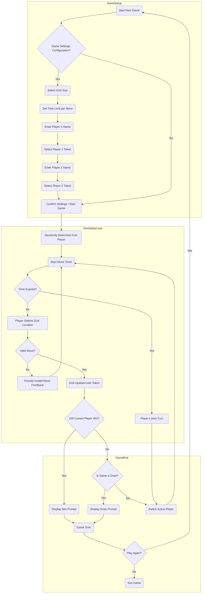

# Overview

This document details the product requirements for a customizable Tic-Tac-Toe game. The primary goal is to provide a robust and engaging experience by allowing users to configure various game parameters, such as grid size and turn time limits, thereby adding strategic depth beyond the traditional 3x3 format. This game is intended to be a foundational piece for a junior developer's portfolio, emphasizing clean code, modular design, and comprehensive feature implementation.

The game will support two players, each with customizable names and tokens. It will feature a clear process flow for game setup, active gameplay, and win/draw condition checking. Special attention will be paid to error handling and user feedback to ensure a smooth and intuitive player experience. 

# Process Flow

# Requirements
| Requirement # | Requirement | Acceptance Criteria |
| ---- | ---- | ---- | 
| 001 | Users must be able to initiate a new game at any point, including after a game has concluded or during an active game session. This action should provide options for configuring new game settings. | <ul><li>Upon selecting the 'New Game' option, the current game board is completely reset to an empty state.</li><li>All previous game progress, scores, and active player statuses are cleared.</li><li>The system prompts the user to configure settings for the new game, such as grid size, time limits, and player details, or proceed with previously saved default settings if available.</li><li>The user interface clearly indicates that a new game setup process has begun.</li></ul> |
| 002 | Users must have the flexibility to customize game parameters before starting a new game. Specifically, they must be able to select the dimensions of the game grid and define a time limit for each player's turn to introduce a strategic element. The available grid sizes are <ul><li>3x3</li><li>5x5</li><li>7x7</li></ul> and the configurable time limits per turn are <ul><li>10 Seconds</li><li>20 Seconds</li><li>30 seconds</li></ul>. | <ul><li>The game presents clear options for selecting grid sizes (3x3, 5x5, 7x7).</li><li>The game presents clear options for selecting time limits per turn (10 seconds, 20 seconds, 30 seconds).</li><li>The selected grid size is visibly applied to the game board upon starting the game.</li><li>The selected time limit is accurately enforced during each player's turn, with a visible countdown mechanism.</li><li>The system provides immediate feedback if a user attempts to select an invalid combination of settings (though for this iteration, all listed combinations are valid).</li><li>Default settings are pre-selected to allow for quick game starts, but user customization is always available.</li></ul> |
| 003 | The game must allow each of the two players to personalize their in-game identity and representation. This includes setting a unique display name and choosing a distinct token icon. While the classic 'X' and 'O' tokens must be available, the system should offer a selection of additional, diverse token icons to enhance player engagement and customization. The game must clearly associate each player with their chosen name and token throughout the gameplay. | <ul><li>The game provides dedicated input fields for Player 1 and Player 2 to enter their display names.</li><li>The game offers a selection mechanism (e.g., dropdown, visual picker) for each player to choose a token icon.</li><li>The available token options must include 'X' and 'O'.</li><li>At least two additional unique token icons beyond 'X' and 'O' are provided.</li><li>The chosen names and tokens are accurately displayed on the game board, scorecards, and any in-game notifications.</li><li>The system prevents both players from selecting the same token icon.</li><li>If no name is provided, a default name (e.g., "Player 1", "Player 2") is used.</li></ul> |
| 004 | To ensure fairness and introduce an element of chance, the game engine must randomly determine which of the two players will take the first turn at the beginning of each new game. This process should be executed automatically after all game and player settings have been finalized and confirmed. | <ul><li>Immediately following the confirmation of game settings, the game engine executes a random selection process to determine the starting player.</li><li>The selection process provides an equal probability for either Player 1 or Player 2 to go first.</li><li>The game clearly communicates to both players who has been selected to go first before the first move is made.</li><li>This random determination occurs every time a new game is started, preventing predictability.</li></ul> 
| 005 | The game must be designed to facilitate two distinct players, managing their turns sequentially and providing clear visual cues to indicate whose turn it currently is. This ensures a structured and understandable gameplay experience for both participants. | <ul><li>The game correctly registers and manages two players throughout the game session.</li><li>Turns alternate consistently between Player 1 and Player 2 after each valid move.</li><li>The user interface prominently displays the name and/or token of the currently active player, making it unambiguous whose turn it is.</li><li>The game prevents the inactive player from making a move.</li><li>Turn progression is intuitive and does not require explicit player action to switch, beyond making a valid move.</li></ul> |
| 006 | To enforce the configured turn time limits and prevent indefinite delays, if a player fails to complete their move within the allotted time, their turn must automatically be forfeited. This action should result in the immediate conclusion of their turn and the automatic transfer of play to the opponent. | <ul><li>A visible countdown timer is displayed for the active player's turn.</li><li>If the timer reaches zero before a valid move is made, the current player's turn is immediately ended.</li><li>The game clearly communicates to both players that a turn has been forfeited due to time expiration.</li><li>Control automatically passes to the next player (or triggers a game-end condition if configured for consecutive forfeits, though not required for this iteration).</li><li>The forfeited turn does not result in an invalid token placement or any other unintended alteration of the game state.</li></ul> |
| 007 | After every player's move, the game must perform a comprehensive check to determine if the active player has achieved a winning condition. A player wins by successfully placing their token to form a continuous line of their tokens across the grid. This includes <ul><li>horizontal rows</li><li>vertical columns</li><li>both main diagonal patterns (top-left to bottom-right, and top-right to bottom-left)</li></ul>. The winning line must consist of a number of tokens equal to the grid size (e.g., 3 tokens for a 3x3 grid, 5 for a 5x5, etc.). | <ul><li>Immediately following each valid token placement, the game engine initiates a check for winning conditions.</li><li>The game accurately identifies wins across all horizontal rows, vertical columns, and both primary diagonal paths.</li><li>The number of contiguous tokens required for a win dynamically adjusts to the configured grid size.</li><li>If a winning condition is detected, the game immediately transitions to a 'Win Prompt' state, clearly identifying the winning player and their token.</li><li>The winning line of tokens is visually highlighted on the game board.</li><li>No further moves are allowed once a win is detected.</li></ul> |
| 008 | In the absence of a winning condition, the game must meticulously check after each move if the game has reached a state where no player can possibly win, even if all remaining empty cells were filled. This scenario defines a 'draw' and should result in the game concluding without a winner. This means evaluating all potential winning lines (rows, columns, diagonals) to ensure none can be completed by either player. | <ul><li>After each move, if no winning condition is met, the game engine checks for a draw condition.</li><li>The game accurately identifies a draw when all cells are filled, and no player has won.</li><li>The game also identifies a draw if there are still empty cells, but no player can mathematically achieve a winning line (e.g., all potential winning lines are blocked by opposing tokens).</li><li>If a draw condition is detected, the game immediately transitions to a 'Draw Prompt' state, clearly indicating that the game ended in a draw.</li><li>No further moves are allowed once a draw is detected.</li></ul> |

# Error Handling
| Requirement # | Error Scenario | Expected Result |
| ---- | ---- | ---- |
| 001 | If a player attempts to place their token in a grid cell that is already occupied by another token (either their own or the opponent's), the game must gracefully prevent this invalid move. Instead of processing the move, the system should provide immediate and unobtrusive visual feedback to the player, indicating that the selected cell is unavailable, without interrupting the flow of the game or penalizing the player with a lost turn. | <ul><li>When a player selects an occupied cell, the token is not placed, and the game state remains unchanged.</li><li>A distinct visual indicator (e.g., a temporary highlight, a brief error message near the attempted move, or a shake animation of the cell) appears to inform the player of the invalid action.</li><li>The visual feedback is transient and does not require explicit dismissal by the user.</li><li>The active player's turn timer continues without interruption, allowing them to make a different, valid move.</li><li>No error messages are displayed in the console or logs for the user, only within the game interface.</li></ul> |

# User Interface (UI) and User Experience (UX) Requirements

| Requirement # | Requirement | Acceptance Criteria |
| ---- | ---- | ---- |
| 009 | The game must provide a clear and intuitive visual representation of the Tic-Tac-Toe grid, dynamically adjusting to the selected grid size (3x3, 5x5, 7x7). Cells should be easily distinguishable, and the placement of player tokens must be evident. | <ul><li>The game board renders correctly for all supported grid sizes.</li><li>Individual cells are clearly demarcated, possibly with borders or background shading.</li><li>Player tokens (X, O, or custom icons) are visibly and centrally placed within their respective cells upon a valid move.</li><li>The overall layout of the board is clean, uncluttered, and easy to interpret.</li></ul> |
| 010 | The game must clearly indicate whose turn it is through a prominent visual cue, along with displaying the active player's name and chosen token. This ensures players always know when it's their time to act. | <ul><li>The active player's name and token are prominently displayed on the screen (e.g., at the top or bottom of the board).</li><li>A visual indicator (e.g., a glowing border around the player's name, a change in text color, or an animated icon) highlights the active player.</li><li>The indicator updates immediately upon a turn switch.</li></ul> |
| 011 | A countdown timer must be visibly displayed during each player's turn, indicating the remaining time for their move. This timer should provide real-time feedback and be easily readable. | <ul><li>A digital timer (e.g., "Time Remaining: 28s") is visible and updates in real-time (second by second).</li><li>The timer is positioned in a clear and accessible area of the UI.</li><li>The timer resets correctly for each new turn.</li><li>Visual feedback (e.g., color change to red, flashing) is provided when the timer is nearing expiration (e.g., last 5 seconds).</li></ul> |
| 012 | The game must provide informative messages for key game events, such as game start, turn changes, win announcements, draw declarations, and invalid moves. These messages should be clear, concise, and non-intrusive. | <ul><li>Messages for game events (e.g., "Player 1 Wins!", "Game Tied!", "Invalid Move: Cell Occupied") are displayed promptly.</li><li>Messages are easy to read and understand, using clear language.</li><li>Messages do not obscure critical game information (e.g., the board or timer).</li><li>Error messages for invalid moves are temporary and disappear after a short duration or upon a valid subsequent action.</li></ul> |
| 013 | The game must offer intuitive controls for player interaction, primarily for selecting cells on the grid. If a mouse-based UI, clicks should register the move. If keyboard-based, clear input prompts should guide the user. | <ul><li>For graphical interfaces, clicking on an empty cell places the active player's token.</li><li>For text-based interfaces, a clear prompt (e.g., "Enter row, column: ") guides the player's input.</li><li>Input validation prevents non-numeric or out-of-bounds entries for text-based games.</li><li>The input mechanism is responsive and feels natural to use.</li></ul> |

# Non-Functional Requirements

| Requirement # | Requirement | Acceptance Criteria |
| ---- | ---- | ---- |
| 014 | The game must exhibit responsive performance, with minimal lag or delays during gameplay. User actions and system responses (e.g., token placement, timer updates) should feel instantaneous. | <ul><li>Token placement on the grid is visually instantaneous after a valid input.</li><li>The turn timer updates smoothly without noticeable stuttering.</li><li>Game state transitions (e.g., from setup to gameplay, or to win/draw screens) are quick and seamless.</li><li>The game consumes a reasonable amount of CPU and memory resources, not impacting overall system performance significantly.</li></ul> |
| 015 | The game's codebase must be well-structured, modular, and adhere to established coding standards and best practices. This ensures maintainability, readability, and ease of future enhancements by a junior developer. | <ul><li>The project is organized into logical modules or classes (e.g., `Game.java`, `Player.java`, `Board.java`, `GameLogic.java`).</li><li>Code is consistently formatted and adheres to a recognized style guide (e.g., Google Java Style Guide if in Java).</li><li>Meaningful comments are used to explain complex logic or non-obvious implementations.</li><li>Variable, method, and class names are descriptive and follow standard naming conventions.</li><li>Dependencies between modules are managed effectively, minimizing tight coupling.</li></ul> |
| 016 | The game should provide basic error handling for unexpected situations (e.g., corrupted configuration files, critical runtime errors) to prevent crashes and provide a stable experience. | <ul><li>The application does not crash due to invalid user inputs or minor unexpected events.</li><li>Critical errors are logged (e.g., to console or a file) for debugging purposes.</li><li>User-facing error messages for unrecoverable issues are graceful and instruct the user on potential next steps (e.g., "An unexpected error occurred. Please restart the game.").</li><li>The game attempts to recover from non-critical errors without terminating the application.</li></ul> |
| 017 | The game must be executable across common desktop operating systems (Windows, macOS, Linux) without requiring complex installation procedures or proprietary software (beyond a standard Java Runtime Environment if applicable). | <ul><li>The compiled game (e.g., JAR file) runs successfully on Windows, macOS, and Linux.</li><li>The game can be launched with a simple command or double-click.</li><li>No platform-specific dependencies hinder cross-OS compatibility.</li><li>Instructions for running the game on different OS are clear and concise if needed.</li></ul> |

# Out of Scope

| Item | Reason for exclusion |
| ---- | ---- |
| **Complex AI Algorithms** | While an AI opponent is a future enhancement, initial scope focuses on core gameplay. Complex AI algorithms would add significant complexity. |
| **Advanced Networking Features** | Initial scope is for a local two-player game. Network play requires significant additional architecture and error handling. |
| **Persistence of Player Profiles/Scores** | Storing and retrieving player data would require database integration or file I/O, adding complexity beyond the core game mechanics. |

# Q&A

| Question | Answer |
| ---- | ---- |
| **What is the primary target audience for this game?** | Casual players seeking a customizable Tic-Tac-Toe experience. |
| **How should game configuration (grid size, time limit) be managed?** | Initially, through in-game prompts or a simple configuration menu at the start of a new game. For future enhancements, a settings file could be considered. |
| **What are the key learning objectives for a junior developer building this?** | Object-Oriented Programming (OOP) principles, algorithm design (win/draw checks), state management, basic UI/UX design, error handling, and potentially unit testing. |
| **Is there a preference for a specific type of user input (e.g., console vs. graphical)?** | The initial implementation can be console-based for simplicity. A graphical interface is a planned future enhancement. |
