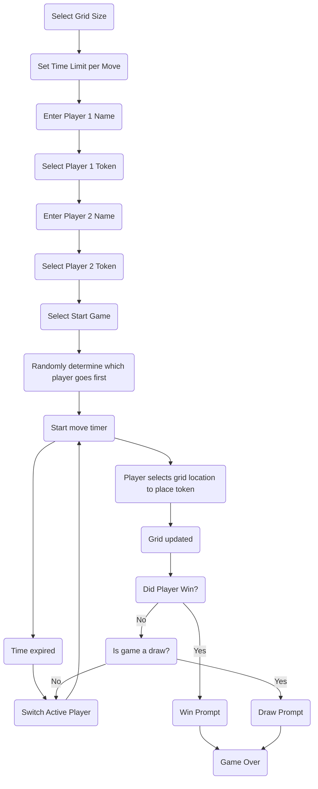

# Overview
Users would like a TicTacToe game that allows them to configure a grid size to make the game more interesting. 

# Process Flow

# Requirements
| Requirement # | Requirement | Acceptance Criteria |
| ---- | ---- | ---- | 
| 001 | Users must be able to select a button to start a new game | Selecting the button to start a new game clears the current board and prompts the user for the new game settings |
| 002 | Users must be able to select their grid size <ul><li>3x3</li><li>5x5</li><li>7x7</li></ul> and the time limit per turn <ul><li>10 Seconds</li><li>20 Seconds</li><li>30 seconds</li></ul> | Users are able to select the grid size and turn time limit |
| 003 | Users must be able to specify player settings such as setting the player name and selecting a token icon. The game must support the traditional X and O icons but additional icons should be provided | Each player is able to specify their display name and token. |
| 004 | Once the game and player settings are specified, the player to go first must be randomly determined | The player who goes first is selected by the game engine randomly | 
| 005 | The game must support two players | The game correctly tracks turns and clearly shows which player is currently active |
| 006 | If a player does not complete their turn within the configured timeframe, the player must lose their turn | A player loses their turn if they do not complete their move within the configured time limit |
| 007 | The game must check if a player has won after each move. A player can win in the following ways <ul><li>Each cell in a row contains the token of the player</li><li>Each cell in a column contains the token of the plaeyr</li><li>Each cell in a diagonal pattern either top left to bottom right or top right to bottom left contains the token of the palyer</li></ul> | The game evaluates the grid to determine if a player has won |
| 008 | The game must check if there is no possible way for either player to win after each move. This means that the game is a draw as there is no possible way for either player to completely fill a row, column, or diagonal with their token. | The game properly identifies when the game is a draw. |

# Error Handling
| Requirement # | Error Scenario | Expected Result |
| ---- | ---- | ---- |
| 001 | The player selects a cell that already has a token | Prevent the placement of the new token and provide visual feedback that the move is invalid. The visual feedback should not interrupt the game play |

# Out of Scope

# Q&A